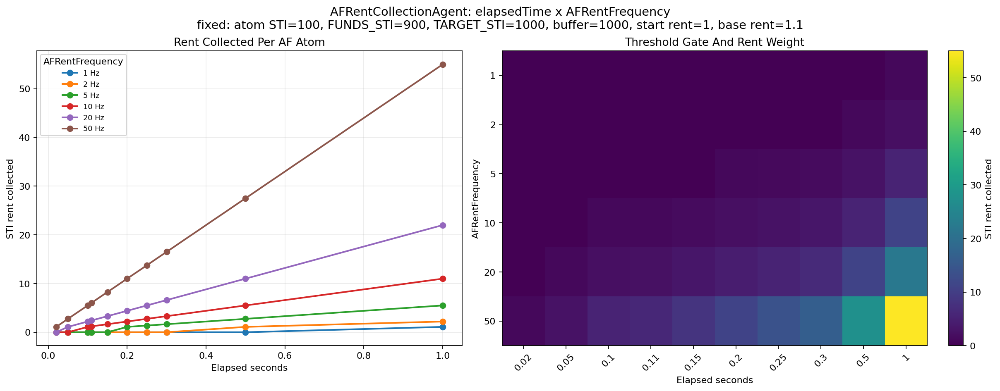
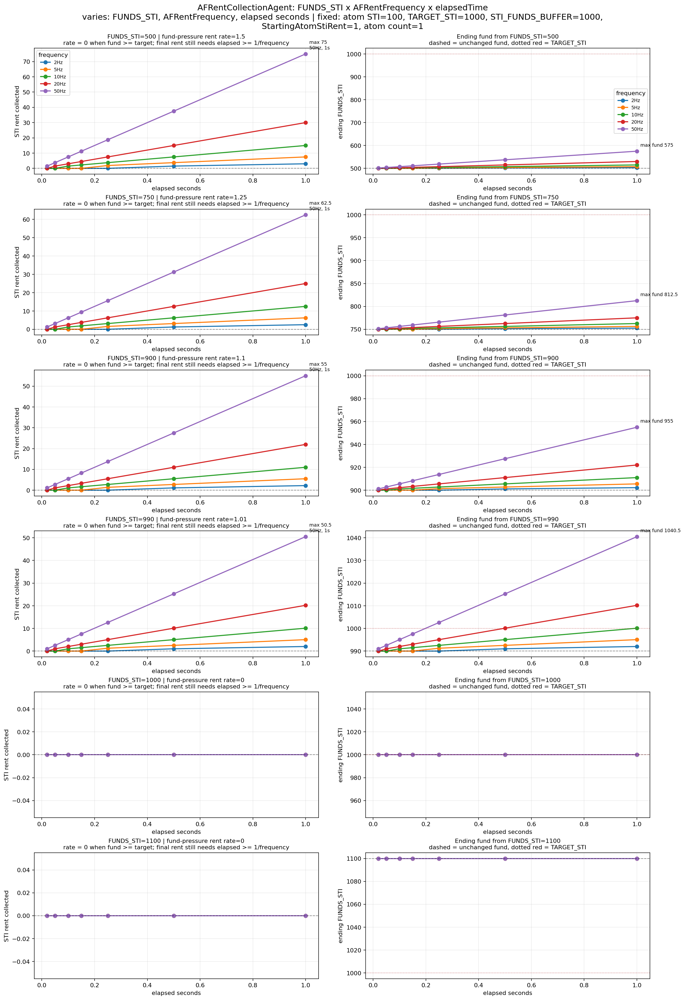
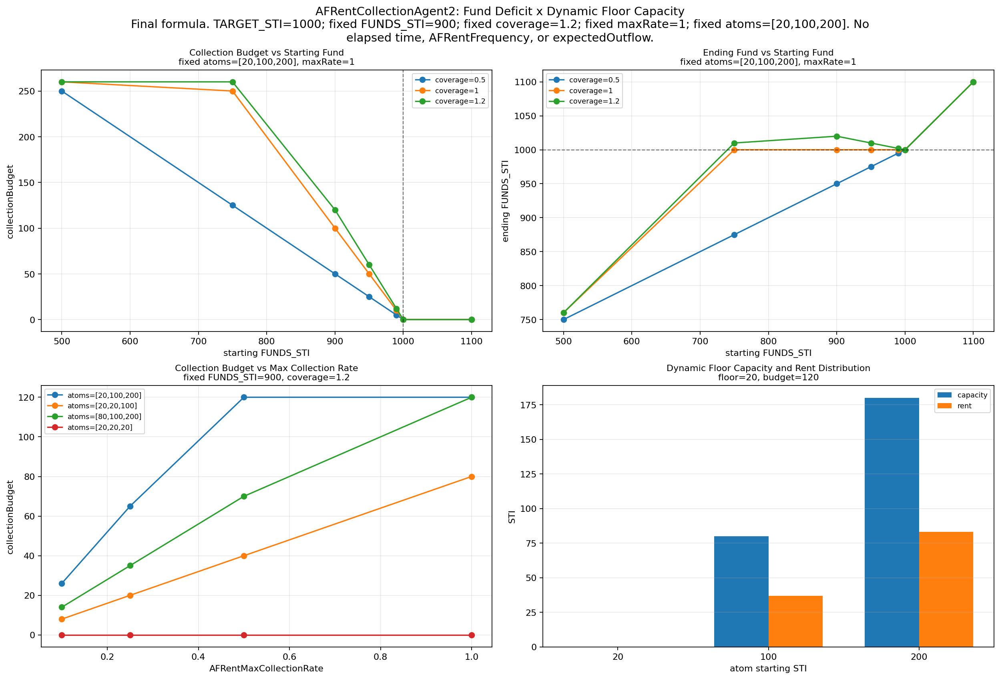

# AF Rent Collection Agent: Current Formula and Proposed Update

## Executive Summary

The current `AFRentCollectionAgent` collects rent from attentional-focus atoms using a wall-clock timer. Rent is only collected when:

```text
elapsedSeconds >= 1 / AFRentFrequency
```

and the amount collected is scaled by:

```text
elapsedSeconds * AFRentFrequency
```

This means two runs with the same ECAN state can collect different rent if the machine, runtime load, atom count, or agent scheduling changes. The fund deficit influences the base rent, but the actual collection amount is still gated and scaled by elapsed runtime.

The proposed `AFRentCollectionAgent2` removes elapsed time from AF rent collection. It directly computes the STI fund gap:

```text
fundGap = max(0, TARGET_STI - FUNDS_STI)
```

and collects from AF atoms in proportion to their STI above the current weakest AF atom:

```text
floorSti = min(AF atom STI)
capacity_i = max(0, STI_i - floorSti)
```

The result is a cycle-based rent rule that is easier to reason about: `AFRentCoverageRatio` controls how much of the fund gap should be repaired, and `AFRentMaxCollectionRate` controls how aggressively rent can be collected from available AF surplus.

## Outline

1. **Current AF Rent Collection Agent**: explains the existing timer gate, base rent formula, and per-atom rent calculation.
2. **Correlation Analysis**: summarizes how `FUNDS_STI`, elapsed time, and `AFRentFrequency` affect collected rent, with Figures 1 and 2.
3. **Shortcomings**: lists the main issues with runtime-dependent rent collection.
4. **Proposed Formula**: introduces the cycle-based fund-gap equation and dynamic STI floor.
5. **Worked Example**: walks through one concrete rent collection cycle.
6. **Improvements**: explains how the proposed formula addresses the current shortcomings.
7. **Remaining Notes**: clarifies that full ECAN runs can still be nondeterministic because of other agents.
8. **Figure 3**: shows the final dynamic-floor formula behavior.
9. **Summary**: compares the current and proposed formulas side by side.

## Purpose

This note summarizes the current AF rent collection behavior, the observed relation between `FUNDS_STI`, elapsed time, and `AFRentFrequency`, and the proposed replacement formula implemented in `AFRentCollectionAgent2.metta`.

The goal is to make AF rent collection depend on the economic state of the ECAN fund, not on machine runtime speed.

## 1. Current AF Rent Collection Agent

Implementation:

- `attention/RentCollectionAgent/AFRentCollectionAgent/AFRentCollectionAgent.metta`
- shared rent helpers: `attention/RentCollectionAgent/RentCollectionBaseAgent/RentCollectionBaseAgent.metta`

The current agent collects rent from atoms in attentional focus only after a timer threshold is satisfied.

### Timer Gate

For each run:

```text
elapsedTime = (currentTime - lastUpdate) * 1,000,000
timeThreshold = 1,000,000 / AFRentFrequency
```

Rent is collected only if:

```text
elapsedTime >= timeThreshold
```

Equivalently, in seconds:

```text
elapsedSeconds >= 1 / AFRentFrequency
```

If the threshold passes, the rent weight is:

```text
w = elapsedTime * AFRentFrequency / 1,000,000
```

Equivalently:

```text
w = elapsedSeconds * AFRentFrequency
```

### Base STI Rent

The current STI rent helper computes:

```text
diff = TARGET_STI - FUNDS_STI
```

If:

```text
diff <= 0
```

then:

```text
baseStiRent = 0
```

Otherwise:

```text
normalizedDeficit = diff / STI_FUNDS_BUFFER
clampedDeficit = clamp(normalizedDeficit, -0.99, 1.0)
baseStiRent = StartingAtomStiRent * (1 + clampedDeficit)
```

Since rent is collected only when the fund is below target, the practical range is:

```text
StartingAtomStiRent <= baseStiRent <= 2 * StartingAtomStiRent
```

### Per-Atom Rent

For each AF atom:

```text
stiRent = min(atomSTI, baseStiRent * w)
newAtomSTI = atomSTI - stiRent
FUNDS_STI increases by stiRent through setAv
```

So, for one atom:

```text
if elapsedSeconds < 1 / AFRentFrequency:
    collected = 0
else:
    collected = min(atomSTI, baseStiRent * elapsedSeconds * AFRentFrequency)
```

For multiple atoms, the total collected is roughly the sum of each atom rent, but the implementation updates `FUNDS_STI` during atom updates, so the effective rent can depend on update order and intermediate fund changes.

## 2. Correlation Between Fund, Elapsed Time, and AFRentFrequency

The current formula has three main effects.

### FUNDS_STI

`FUNDS_STI` controls whether rent is needed and how large the base rent is.

```text
FUNDS_STI >= TARGET_STI  ->  baseStiRent = 0
FUNDS_STI <  TARGET_STI  ->  baseStiRent increases with deficit
```

Example with:

```text
TARGET_STI = 1000
STI_FUNDS_BUFFER = 1000
StartingAtomStiRent = 1
```

```text
FUNDS_STI = 1000  -> baseStiRent = 0
FUNDS_STI = 900   -> baseStiRent = 1.1
FUNDS_STI = 500   -> baseStiRent = 1.5
FUNDS_STI = 0     -> baseStiRent = 2.0
```

### Elapsed Time

Elapsed time controls whether the timer gate opens and also scales the rent amount.

For fixed frequency:

```text
small elapsed time below threshold -> no rent
larger elapsed time above threshold -> more rent
```

This means two machines can collect different rent from the same ECAN state if one machine runs the agent cycle faster or slower.

### AFRentFrequency

`AFRentFrequency` affects both:

```text
1. the threshold: 1 / AFRentFrequency
2. the rent weight: elapsedSeconds * AFRentFrequency
```

Higher frequency:

- lowers the elapsed-time threshold,
- makes rent more likely to run,
- increases the rent amount for the same elapsed time after the threshold passes.

### Figure 1



**Figure 1.** Current AF rent collection is zero below the timer threshold and grows with `elapsedSeconds * AFRentFrequency` after the threshold opens.

### Figure 2



**Figure 2.** Current rent collection depends on the fund deficit, but the actual amount collected is still gated and scaled by runtime elapsed time.

## 3. Shortcomings of the Current Formula

### 1. Rent Depends on Machine Runtime

The timer uses wall-clock elapsed time. Therefore rent collection depends on:

- machine speed,
- number of atoms processed,
- other agents running in the same cycle,
- OS/runtime scheduling,
- how often the agent runner calls the rent agent.

This makes economic circulation partly dependent on runtime behavior instead of only ECAN state.

### 2. Frequent Calls Can Prevent Rent

The agent updates `lastUpdate` after the run. If the runner calls the agent repeatedly before the threshold is reached, elapsed time can remain too small and rent may not be collected.

This can keep `FUNDS_STI` low even when AF atoms have enough STI to refill the fund.

### 3. Frequency Has Two Meanings

`AFRentFrequency` is both:

- a gate parameter deciding whether rent can run,
- a multiplier deciding how much rent is collected.

This makes the parameter hard to reason about. Increasing frequency changes both timing and magnitude.

### 4. The Fund Deficit Is Indirect

The current formula increases base rent when `FUNDS_STI` is below `TARGET_STI`, but it does not directly ask:

```text
How much STI must be returned to repair the fund gap?
```

Instead, rent is computed per atom from a base rent and timer weight.

### 5. Multi-Atom Collection Is Hard to Predict

Each atom update changes the global fund. With multiple atoms, the effective total rent is harder to predict because each update can alter the next calculation context.

## 4. Proposed AF Rent Collection Formula

Implementation:

- `attention/RentCollectionAgent/AFRentCollectionAgent/AFRentCollectionAgent2.metta`
- tests: `attention/RentCollectionAgent/AFRentCollectionAgent/tests/AFRentCollectionAgent2-test.metta`

The proposed agent removes wall-clock elapsed time from AF rent collection.

Rent is collected when:

```text
FUNDS_STI < TARGET_STI
```

### Fund Gap

```text
fundGap = max(0, TARGET_STI - FUNDS_STI)
```

### Desired Collection

```text
desiredCollection = AFRentCoverageRatio * fundGap
```

Interpretation:

- `AFRentCoverageRatio = 1.0` tries to refill the fund exactly to target.
- `AFRentCoverageRatio > 1.0` tries to refill beyond target, creating a small fund cushion.
- `AFRentCoverageRatio < 1.0` performs partial recovery.

### Dynamic STI Floor

Instead of using a fixed STI floor parameter, the proposed formula uses the weakest current AF atom as the floor:

```text
floorSti = min(STI_i for i in AF)
```

Each atom can only pay from STI above that floor:

```text
capacity_i = max(0, STI_i - floorSti)
```

Total collectable capacity:

```text
totalCapacity = sum(capacity_i)
```

This means the minimum-STI atom pays zero rent:

```text
if STI_i == floorSti:
    capacity_i = 0
    rent_i = 0
```

### Collection Budget

```text
collectionBudget = min(
    desiredCollection,
    AFRentMaxCollectionRate * totalCapacity
)
```

Interpretation:

- `desiredCollection` says how much the fund wants.
- `AFRentMaxCollectionRate * totalCapacity` caps how aggressively we can collect from atoms.
- If there is not enough available capacity, the fund recovers partially instead of pushing atoms below the dynamic floor.

### Per-Atom Rent

If:

```text
totalCapacity <= 0
```

then:

```text
rent_i = 0
```

Otherwise:

```text
rent_i = collectionBudget * capacity_i / totalCapacity
newAtomSTI_i = STI_i - rent_i
```

## 5. Example

Given:

```text
FUNDS_STI = 900
TARGET_STI = 1000
AFRentCoverageRatio = 1.0
AFRentMaxCollectionRate = 1.0

AF atom STI values = [20, 100, 200]
```

Compute fund gap:

```text
fundGap = 1000 - 900 = 100
desiredCollection = 1.0 * 100 = 100
```

Compute dynamic floor:

```text
floorSti = min(20, 100, 200) = 20
```

Compute capacities:

```text
atom 20:  20 - 20 = 0
atom 100: 100 - 20 = 80
atom 200: 200 - 20 = 180

totalCapacity = 260
```

Compute budget:

```text
collectionBudget = min(100, 1.0 * 260) = 100
```

Distribute rent:

```text
atom 20:  100 * 0/260   = 0.00
atom 100: 100 * 80/260  = 30.77
atom 200: 100 * 180/260 = 69.23
```

Ending STI:

```text
atom 20:  20.00
atom 100: 69.23
atom 200: 130.77
```

Ending fund:

```text
FUNDS_STI = 900 + 100 = 1000
```

The weakest atom is protected because it defines the dynamic floor.

## 6. How the Proposed Formula Addresses the Shortcomings

### 1. Removes Wall-Clock Runtime Dependency

The proposed formula does not use elapsed time. For the same:

```text
FUNDS_STI
TARGET_STI
AF atom STI values
AFRentCoverageRatio
AFRentMaxCollectionRate
```

it computes the same rent budget.

### 2. Connects Rent Directly to Fund Deficit

The current formula indirectly increases base rent when the fund is low.

The proposed formula directly computes:

```text
TARGET_STI - FUNDS_STI
```

and collects against that gap.

### 3. Separates Economic Policy From Scheduling

The new parameters have clearer meanings:

```text
AFRentCoverageRatio:
    how much of the fund gap should be repaired

AFRentMaxCollectionRate:
    how much of available atom surplus can be collected per cycle
```

No parameter controls both timer gating and rent magnitude.

### 4. Protects the Weakest AF Atoms

The dynamic floor prevents rent from pushing atoms below the current minimum AF STI.

This avoids using a fixed floor value that may be too high or too low for a changing ECAN state.

### 5. Makes Capacity Explicit

The formula makes the maximum collectable amount visible:

```text
maxCollectable = AFRentMaxCollectionRate * totalCapacity
```

So if the fund does not fully recover, the reason is clear:

```text
desiredCollection > maxCollectable
```

## 7. Remaining Notes

The proposed AF rent equation is deterministic for a fixed AF state. However, the full ECAN run can still be nondeterministic because other agents currently use:

- random AF or non-AF atom selection,
- `hyperpose`,
- wall-clock elapsed time in WA rent collection,
- order-sensitive updates to shared atom spaces.

So to evaluate the proposed AF rent equation precisely, tests should call `collectAFRent2` with an explicit target atom list and fixed attention parameters.

## 8. Figure 3



**Figure 3.** Proposed rent collection uses the direct fund deficit and available STI capacity above the dynamic floor. It uses `FUNDS_STI`, `TARGET_STI`, `AFRentCoverageRatio`, `AFRentMaxCollectionRate`, and the AF atom STI distribution. It does not use elapsed time, `AFRentFrequency`, or expected outflow.

## 9. Summary

The current AF rent collection formula is:

```text
rent_i = min(
    STI_i,
    calculateStiRent(StartingAtomStiRent) * elapsedSeconds * AFRentFrequency
)
```

subject to:

```text
elapsedSeconds >= 1 / AFRentFrequency
```

The proposed AF rent collection formula is:

```text
fundGap = max(0, TARGET_STI - FUNDS_STI)
desiredCollection = AFRentCoverageRatio * fundGap
floorSti = min(STI_i)
capacity_i = max(0, STI_i - floorSti)
collectionBudget = min(desiredCollection, AFRentMaxCollectionRate * sum(capacity_i))
rent_i = collectionBudget * capacity_i / sum(capacity_i)
```

The key change is that rent collection becomes fund-deficit-driven instead of elapsed-time-driven.