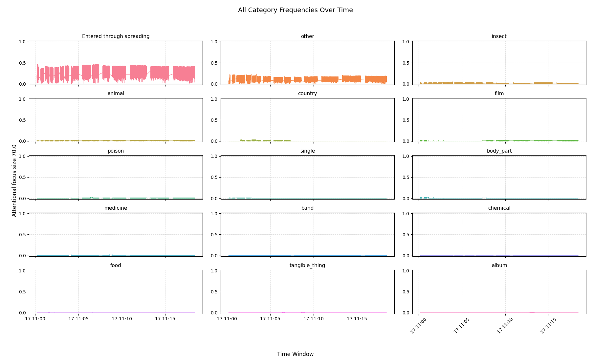

# ECAN Experiment in MeTTa: Shifting and Drifting Attention

This document summarizes an experiment conducted using **ECAN (Economic Attention Network)** with **MeTTa**. The goal was to observe and analyze the behavior of **attentional shifting** and **drifting**.


## 1.Description

The experiment aimed to simulate how attention shifts and drifts within a cognitive system when presented with sequential inputs related to different concept groups. Specifically, it focused on two primary categories:
- **Insect-related concepts**: Representing one domain of interest.
- **Poison-related concepts**: Representing another domain of interest.
- **Insecticide**: Acting as a bridge concept linking both domains.

The ECAN, implemented in MeTTa, manages attention through agents such as Hebbian link creation, Importance diffusion, Rent collection, and Forgetting. The experiment tracked how these mechanisms influence the movement of atoms into and out of the **Attentional Focus (AF)** over time.


## 2.The Data used in the experiment

The input data consisted of two sets of sentences:
1. **Insect-related sentence**: Stimulated the system with insect-related concepts.
2. **Poison-related sentence**: Stimulated the system with poison-related concepts.
   

Key points about the data:
- Due to performance limitations in MeTTa, only short input sentences were used.
- `Insecticide` served as a bridge concept, connecting the insect and poison domains.
- The system processed these inputs sequentially: first insect-related sentence, then poison-related sentence.


## 3. How to run the experiment

The experiment needs a prepared knowledge base before `experiment.metta` is run.
From the `metta-attention` repository root, run:

```sh
sh run.sh
```

This downloads `experiments/data/kg.metta`, which is the knowledge base used by
the diffusion experiment. The file is generated from ConceptNet data and is
organized as words paired with their related links. This tuple-style structure
makes pattern matching simpler for the diffusion agent than searching directly
through the raw `conceptnet.metta` link file. In other words, `kg.metta` is the
final ConceptNet knowledge-base artifact used by the experiment.

`setup.sh` contains the longer data-preparation pipeline that downloads and
converts the raw ConceptNet and WordNet resources. The experiment itself uses
the prebuilt `kg.metta` downloaded by `run.sh`. The `kg.metta` file contains the
ConceptNet knowledge base for this experiment; WordNet data is not included in
that file.

After `kg.metta` is available, go to the PeTTa repository. PeTTa should be a
sibling directory of `metta-attention`, for example:

```text
parent-folder/
  PeTTa/
  metta-attention/
```

Then run the experiment from inside `PeTTa`:

```sh
sh run.sh ../metta-attention/experiments/experiment.metta
```

The experiment writes its logs under:

```text
metta-attention/experiments/output/
```

The main files are:

- `output.csv`: timestamped snapshots of the atoms in the Attentional Focus and
  their STI values.
- `settings.json`: the attention parameters used for the run.
- `plot_faceted.png` and `plot_interactive.html`: visualizations generated by
  the plotter.

To plot the CSV output from the `metta-attention` repository root, run:

```sh
python3 experiments/plot.py experiments
```

The plotter reads `experiments/output/output.csv` and
`experiments/output/settings.json`, groups the logged atoms by the categories in
`experiments/data/words.json`, and shows how concepts move through the
Attentional Focus over time.

### Running with different parameters

Most experiment parameters are set near the top of
`experiments/experiment.metta`. Change these values before running the
experiment again:

- `MAX_AF_SIZE`: maximum Attentional Focus size.
- `(= (batch) 25)`: how many stimulated atoms are processed before the ECAN
  agents run.
- `TARGET_STI` and `TARGET_LTI`: target short-term and long-term importance.
- `STI_FUNDS_BUFFER` and `LTI_FUNDS_BUFFER`: reserved STI and LTI funds.
- `FUNDS_STI` and `FUNDS_LTI`: total available STI and LTI funds.
- `TOPK`: the proportion of candidate atoms considered during spreading.
- `(stimulate $now 30)`: stimulation amount given to each input atom.

After changing parameters, rerun the PeTTa command above. The new values will be
recorded in `experiments/output/settings.json`, and the updated Attentional
Focus trace will be written to `experiments/output/output.csv`.

## 4. Execution flow

The experiment was executed using the following steps:

### Initialization
1. **Import Modules**:
   - Imported essential modules for attention management, including:
     - ForgettingAgent, RentCollectionAgent, ImportanceDiffusionAgent, HebbianUpdatingAgent, and HebbianCreationAgent.
   - Configured the parameters  in the attention bank

2. **Load Knowledge Base**:
   - Loaded the knowledge base containing predefined relationships between concepts.
   - Initialized the system with specific sentences for insects and poisons.

### Input Processing
3. **Stimulate Concepts**:
   - Used the `insectPoisonReadExp` function to process insect-related sentence first, followed by poison-related sentence.
   - Each word in the sentence is stimualated, increasing  it's Importance value.

4. **Execute ECAN Agents**:
   - Ran ECAN agents at each step to manage attention dynamics:

     - **HebbianCreationAgent**:creates ASYMMETRIC_HEBBIAN_LINK  connections between atoms in the attentional focus
     - **HebbianUpdatingAgent**:the HebianUpdating updates the Truthvalue's (mean, confidence) of ASYMMETRIC_HEBBIAN_LINK links
     - **AFImportanceDiffusionAgent**: Diffuse importance within the Attentional Focus.
     - **AFRentCollectionAgent**: Collected rent from  atoms in the Attentional Focus.
     - **ForgettingAgent**: an agent responsible for removing atoms of any kind from the all relevant spaces available.

5. **Monitor Attentional Focus**:
   - Tracked the frequency of different concept categories entering the Attentional Focus over time.
   - Logged results to analyze attentional shifting and drifting.


## 5. Results

The experiment produced the following insights based on the plot titled **"Category Frequency Over Time"**:

### Key Observations
1. **Shifting of Attention**:
   - After processing insect-related sentences, the focus shifted toward poison-related concepts when poison-related sentences were introduced.
   - This shift was evident in the increased prominence of poison-related atoms in the Attentional Focus.

2. **Drifting of Attention**:
   - the `insecticide` concept (a bridge concept) appeared steadily in the Attentional Focus.
   - This demonstrates **drifting**, where related but unstimulated concepts enter the focus due to their connections to stimulated concepts.

3. **Importance Diffusion**:
   - The red line labeled **"Entered through spreading"** confirmed that related atoms entered the focus via importance diffusion.
   - This highlights how ECAN dynamically redistributes attention across connected concepts.

4. **Noise in the System**:
   - Due to short input contexts and performance constraints, unrelated ("noisy") atoms occasionally entered the Attentional Focus.
   - These noisy entries were more pronounced during transitions between input phases.

### Plot Analysis

Here is the plot showing the **Category Frequency Over Time**:



#### Observations from the Plot:
- **Insect-related concepts** dominated initially but decreased after poison-related sentences were introduced.
- **Poison-related concepts** rose in prominence, reflecting attentional shifting.
- **Insecticide** remained steady, illustrating drifting behavior.
- The **red line** ("Entered through spreading") showed consistent entry of related atoms via diffusion.


## 6. Conclusion

Despite the performance limitations of MeTTa, which restricted the use of longer texts, the experiment clearly demonstrated the following:

1. **Shifting of Attention**:
   - The system effectively shifted attention from insect-related concepts to poison-related concepts upon receiving new, directly stimulated input.

2. **Drifting of Attention**:
   - Unstimulated but related concepts (e.g., `insecticide`) drifted into the Attentional Focus due to their connections to stimulated concepts.

3. **Dynamic Focus Management**:
   - ECAN's agents (e.g., Hebbian links, importance diffusion, rent collection) successfully managed attention allocation over time.

### Future Improvements
- **Enhanced Performance**: Improving MeTTa's performance would allow for longer and more complex inputs, enabling richer transitions and interactions.
- **Noise Reduction**: Refining the system to better filter out unrelated atoms could enhance focus clarity.


This experiment provides strong evidence for the effectiveness of ECAN's attention allocation in MeTTa, validating its ability to stimulate dynamic cognitive processes like attentional shifting and drifting.
