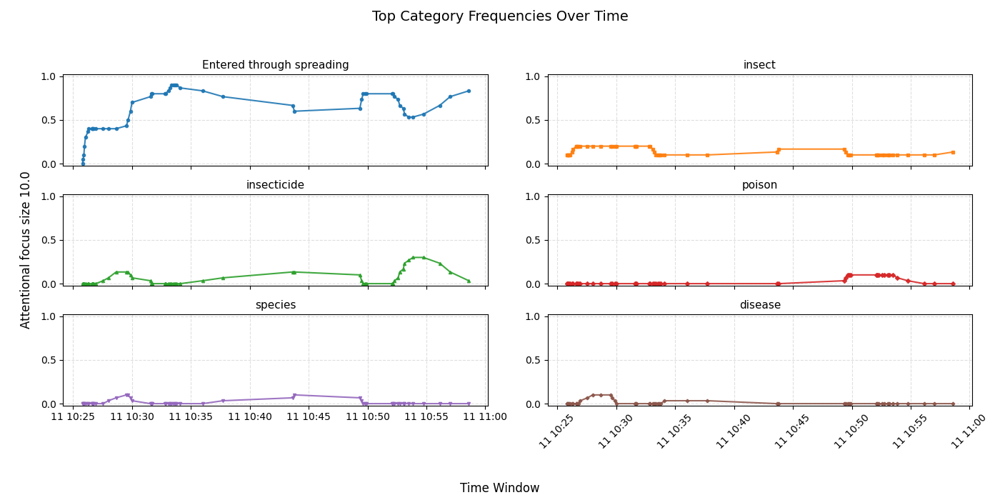
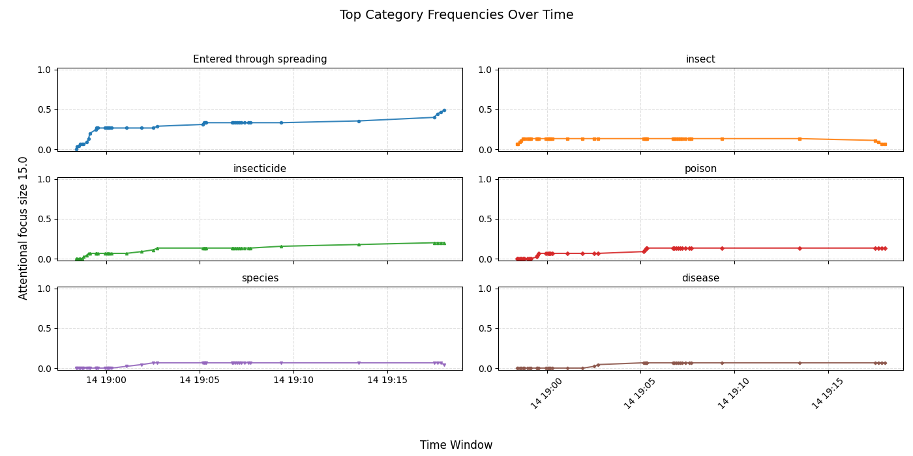

## ECAN Experiment 1: Shifting and Drifting While Reading
- This experiment replicates and extends the original attention modeling work done in the OpenCog ECAN system, titled "Shifting and drifting attention while reading".

### 1. General Description
- This experiment investigates ECAN's capability to simulate attention allocation and topic drifting while reading a stream of related concepts. Specifically, we aim to reproduce the patterns of attention observed in the original OpenCog experiment using a ported ECAN implementation in MeTTa.

#### The core focus is to analyze:

- How attention drifts from one category to another when topic context changes.

- How ECAN allocates limited attentional focus when the cognitive context is stimulated with semantically linked concepts over time.

- 2. Data
- Unlike the previous version, this experiment uses a smaller dataset due to the current MeTTa runtime's performance constraints.

    - Data Structure
    - Located in experiment1/data, the dataset includes:

        - insect-words.metta

        - poison-words.metta

        - insecticide-words.metta

        - species-words.metta

        - disease-words.metta

        - links.metta – contains semantic links across the above categories.

- Example Links (links.metta)
    The file includes a total of 40 curated links:

    20 SimilarityLinks (e.g., insecticide ↔ insect or poison)

    10 MemberLinks (e.g., aphid ∈ pest species)

    10 CausesLinks (e.g., aflatoxin → liver cancer)

- Link distribution:

    - 50% of links connect insecticides to poisons

    - 25% connect insects/poisons to diseases

    - 25% connect insects/poisons to species

- This distribution provides a balanced structure to observe meaningful topic shifts across semantic categories.

### 3. Execution Process
- Overview
- Randomly stimulate words from the insect-words file.

- After a defined number of insect stimulations, switch to stimulating words from the poison-words file.

- While stimulation occurs, a suite of ECAN attention agents operate in parallel:

    - HebbianCreationAgent

    - HebbianUpdatingAgent

    - AFImportanceDiffusionAgent

    - AFRentCollectionAgent

- Attentional snapshots are logged after each word stimulation.

Attention Configuration
The ECAN system is parameterized with:

    
    !(updateAttentionParam MAX_AF_SIZE 10.0)
    !(updateAttentionBank targetSti 1000.0)
    !(updateAttentionBank targetLti 1000.0)
    !(updateAttentionBank stiFundsBuffer 1000.0)
    !(updateAttentionBank ltiFundsBuffer 1000.0)
    !(updateAttentionBank fundsSTI 2000.0)
    !(updateAttentionBank fundsLTI 2000.0)
    

    
- Core Experiment Loop
- Here is the main execution loop that handles word stimulation and topic shifts:

    ```(insectPoisonExp 3 &insect insect)```
- This logic stimulates a mix of insect and poison terms, allowing attention to accumulate on their associated concepts through stimulation and diffusion mechanisms.

- Agents and Modules
- Imported modules for the experiment include:

        !(import! &self metta-attention:attention:AFImportanceDiffusionAgent)
        !(import! &self metta-attention:attention:AFRentCollectionAgent)
        !(import! &self metta-attention:attention:HebbianUpdatingAgent)
        !(import! &self metta-attention:attention:HebbianCreationAgent)
        !(import! &insect metta-attention:experiments:Metta:experiment1:data:insect-words)
        !(import! &poison metta-attention:experiments:Metta:experiment1:data:poison-words)
        !(import! &tempspace metta-attention:experiments:Metta:experiment1:data:links)

### 4. Results
- Two separate experiment runs were conducted with different MAX_AF_SIZE settings:

        image2: Run 1 (MAX_AF_SIZE = 10) 
        
    

        image3: Run 2 (MAX_AF_SIZE = 15)
    
### Observations:
- In both runs, attention starts focused on insect-related words.

- Upon switching to poison words, a clear attention shift occurs.

- Due to a higher number of SimilarityLinks involving insecticides, they received greater attention in the drifting phase.

- Disease and species links appeared occasionally but were less dominant due to their lower representation in the link set.

### 5. Conclusion
- This experiment successfully reproduces the original ECAN drifting and attention allocation behavior in the MeTTa-based ECAN system.

Key takeaways:

- The shift in attention across semantic categories is observable and controllable via stimulation strategy.

- Link structure and link type distribution significantly influence which concepts dominate attention.

- Lower MAX_AF_SIZE values produce sharper transitions, while larger sizes allow more sustained overlap between topics.
